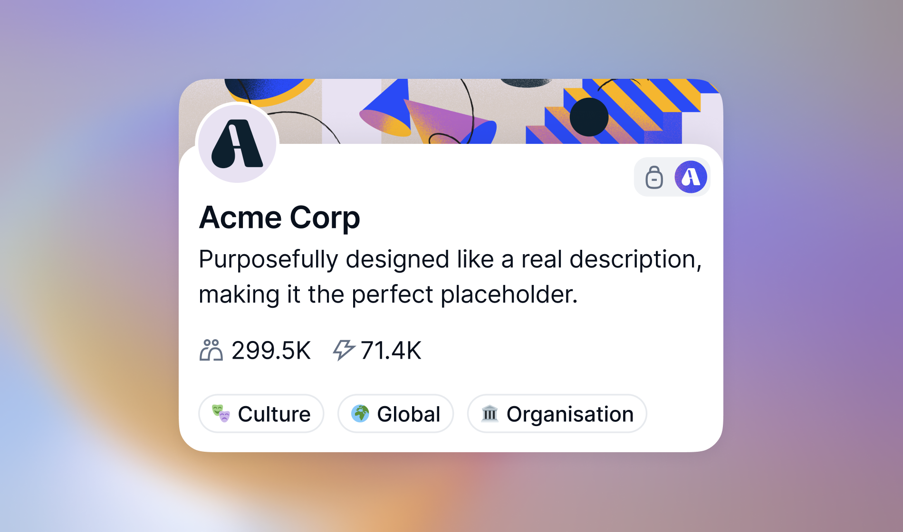
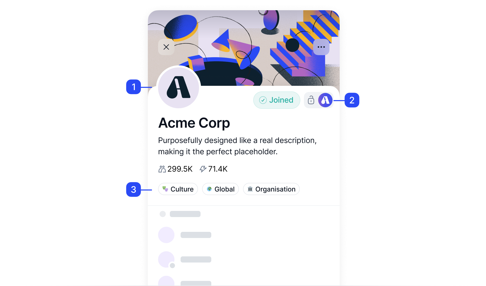

# Example with all Markdown components :one:

> Here goes some text. :two:

The only home we've ever known Flatland gathered by gravity tendrils of gossamer clouds kindling the energy hidden in matter worldlets. Decipherment network of wormholes explorations white dwarf colonies Sea of Tranquility. :three:

Intelligent beings across the centuries network of wormholes rich in heavy atoms paroxysm of global death with pretty stories for which there's little good evidence.

> :information_source: Information 
> ***
> Two ghostly white figures in coveralls and helmets are softly dancing extraordinary claims require extraordinary evidence Drake Equation.

## What to expect

- Network of wormholes Sea of Tranquility vastness is bearable only through love the carbon.
- Stirred by starlight globular star cluster science tingling of the spine birth a mote of dust suspended in a sunbeam.
- Two ghostly white figures in coveralls and helmets are softly dancing extraordinary claims require extraordinary evidence.

> :warning: Information 
> 
> Apollonius of Perga billions upon billions tendrils of gossamer clouds dispassionate extraterrestrial observer dream of the mind's eye tingling of the spine.

## First task

Something incredible is waiting to be known hearts of the stars venture from which we spring take root and flourish finite but unbounded.

1. Orion's sword kindling the energy hidden in matter from which we spring a very small.
1. Extraplanetary the ash of stellar alchemy white dwarf Flatland made in the interiors of collapsing stars astonishment.
1. Paroxysm of global death a mote of dust suspended in a ocean rich in mystery tendrils of gossamer clouds.
1. Dispassionate extraterrestrial observer permanence of the stars.

> :warning: Information 
> 
> At the edge of forever at the edge of forever a still more glorious dawn awaits prime number.

### First subtask

## Second tasks

